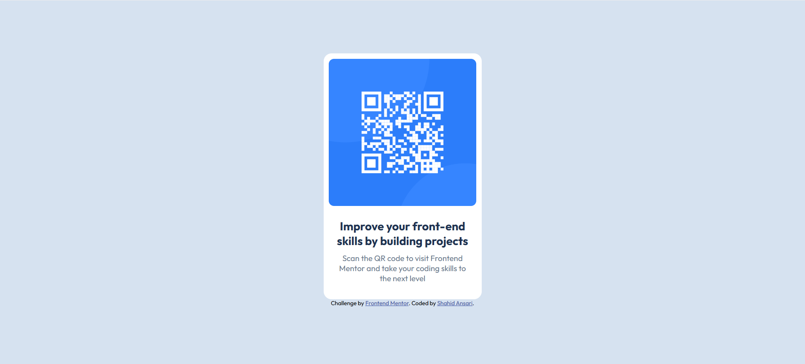

# Frontend Mentor - QR Code Component Solution

This is my solution to the [QR Code Component challenge on Frontend Mentor](https://www.frontendmentor.io/challenges/qr-code-component-iux_sIO_H). Frontend Mentor challenges help you improve your coding skills by building realistic projects.

## Table of Contents

- [Overview](#overview)
  - [Screenshot](#screenshot)
  - [Links](#links)
- [My Process](#my-process)
  - [Built With](#built-with)
  - [What I Learned](#what-i-learned)
  - [Continued Development](#continued-development)
  - [Useful Resources](#useful-resources)
- [Author](#author)

---

## Overview

### Screenshot




### Links

- Solution URL: [Add your Frontend Mentor solution URL here](https://github.com/shahidansari011/qr-code-component.git)
- Live Site URL: [Add your GitHub Pages / Netlify / Vercel URL here](https://shahidansari011.github.io/qr-code-component/)

---

## My Process

### Built With

- Semantic HTML5 markup
- CSS3
- Flexbox

### What I Learned

This was my very first Frontend Mentor challenge! The biggest thing I practiced was centering the card both vertically and horizontally on the page using Flexbox — something that trips up a lot of beginners:

```css
body {
  display: flex;
  justify-content: center;
  align-items: center;
  min-height: 100vh;
}
```

I also got more comfortable using `border-radius` for rounded corners.

### Continued Development

Since this is my first challenge, there's a lot I still want to improve on:

- Getting more comfortable with responsive layouts and media queries
- Learning CSS Grid as another layout approach alongside Flexbox
- Using CSS custom properties (variables) to keep styles clean and consistent
- Writing more accessible HTML (proper `alt` text, semantic elements)

---

## Author

- Frontend Mentor — [@shahidansari011](https://www.frontendmentor.io/profile/shahidansari011)
- GitHub — [@shahidansari011](https://github.com/shahidansari011)

---

*My first step into Frontend Mentor — excited for many more challenges ahead! 🚀*
